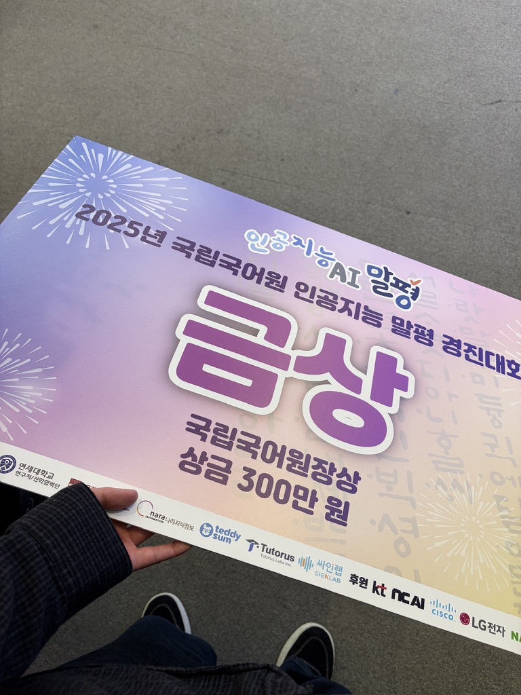
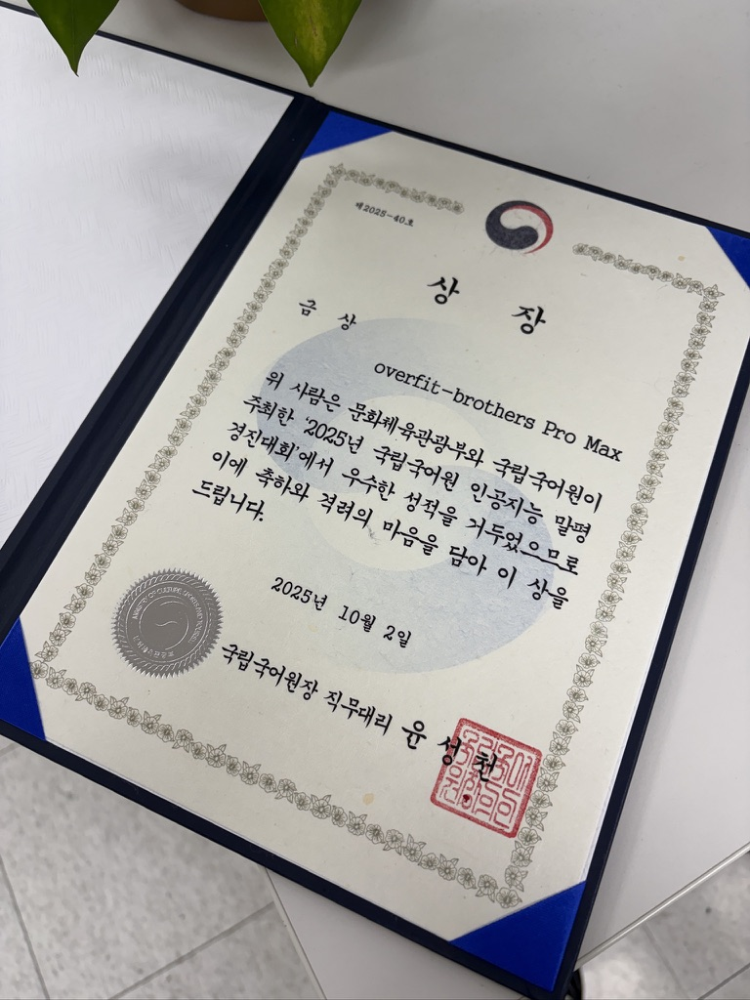

- 대회명: 2025 국립국어원 AI말평경진대회
- 팀명: overfit-brothers Pro Max
- 일시: 2025.10.02

국립국어원에서 주최한 2025년 국립국어원 인공지능 말평 경진대회에서 금상(국립국어원장상)을 수상하게 되었습니다.🏆

홈페이지: https://lnkd.in/gD4gFCW9

저희가 참여한 트렉은 한국어 어문 규범 관련 질문에 대하여 국어 지식을 참조하여 대형 언어 모델이 적절한 답변을 하는지 평가하는 대회였습니다.

저희 팀은 다음과 같은 3가지 주요 기법을 활용해 좋은 결과를 얻을 수 있었습니다. 
- 1️⃣. Query Expansion: 사용자의 자연어 질문이 검색에 맞는 형태로 변형하는 방법
- 2️⃣. Dynamic Few-shot: 사용자의 질의와 가장 비슷한 Few-shot 예시를 동적으로 검색하는 방법
- 3️⃣. DataCollatorForCompletion: 전체 질문이 아닌 응답에만 loss를 주어 정교한 답변 생성하는 방법

